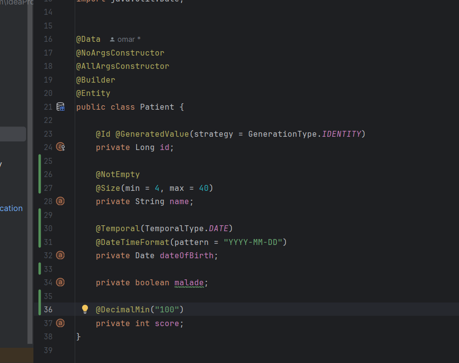
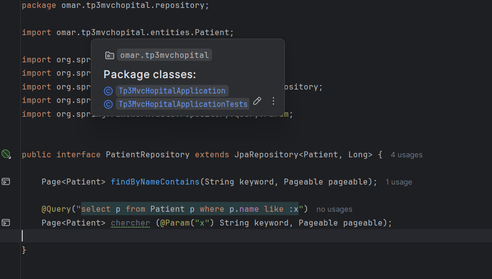
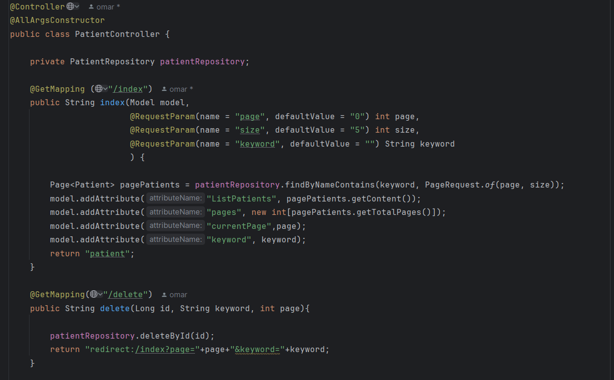
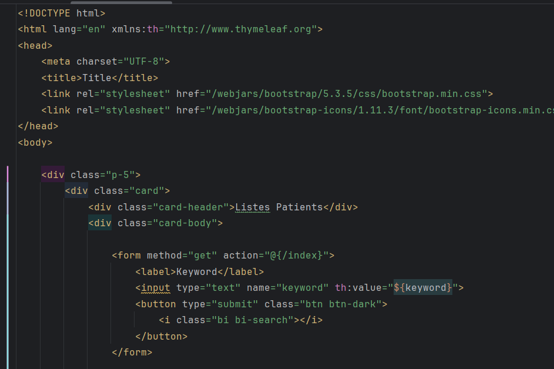
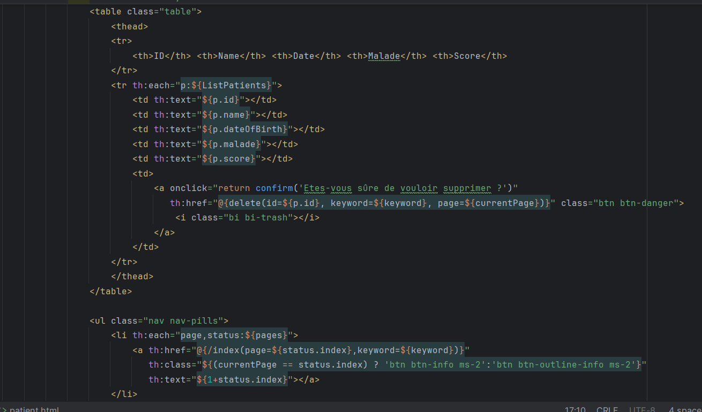
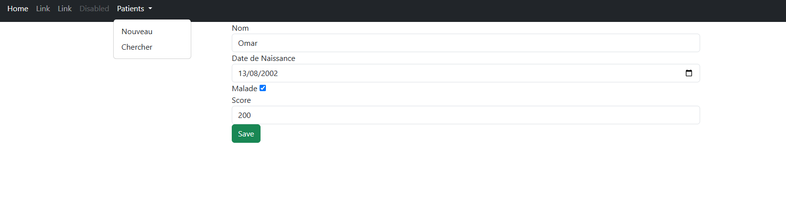
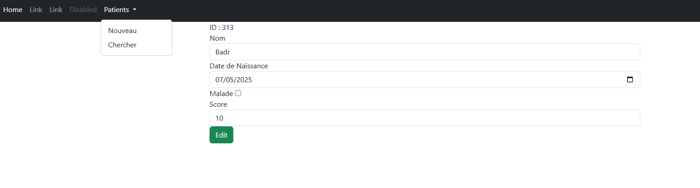

<h2> Class Patient </h2>

<h2> Interface PatientRepository </h2>

<h2> Methodes used in Controller </h2>

<h2> List des Patients </h2>

<h2> Form to Add Patients </h2>

<h2> Edit Patient Info </h2>

